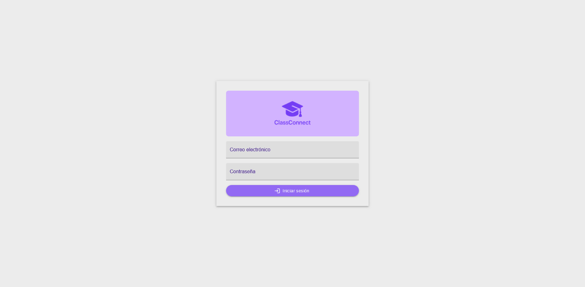
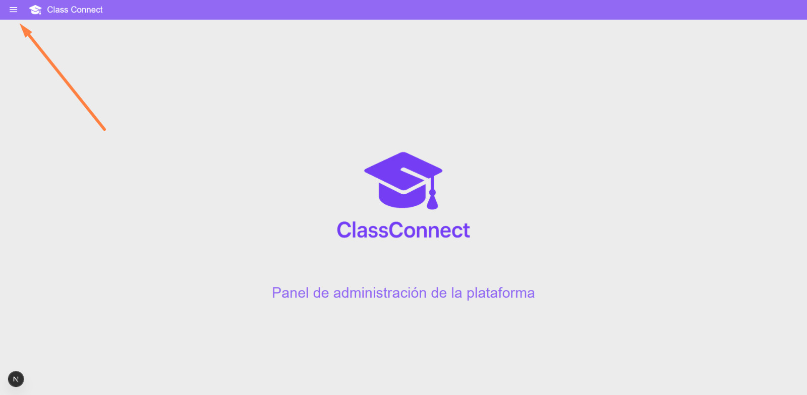
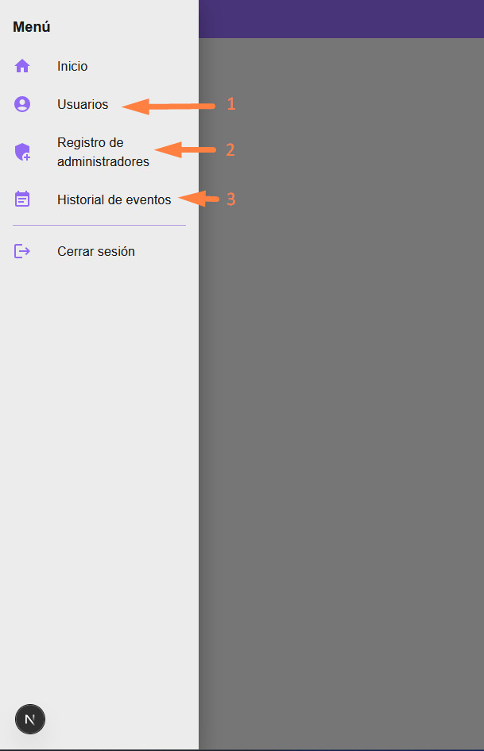

# Guía del Administrador

Esta sección está destinada a los administradores del sistema que gestionan la configuración y el mantenimiento de la aplicación. Aquí encontrarás toda la información necesaria para hacer uso del sistema de administración, incluyendo la configuración de usuarios, bloqueo de usuarios y otras tareas administrativas.

## Ingreso al Panel de Administración

Para acceder al panel de administración, debemos ingresar a al siguiente enlace: [Panel de Administración](https://cc-webadmin.vercel.app/).

## Inicio de Sesión

Para podes acceder a las funcionalidades del panel de administración, es necesario iniciar sesión con un usuario que tenga permisos de administrador. Si no tienes un usuario de administrador, deberás solicitar a un administrador existente que te proporcione acceso.

Ahora, si ya tienes un usuario de administrador, puedes iniciar sesión con tus credenciales ingresando el correo electrónico y la contraseña en el formulario de inicio de sesión.

## Funcionalidades del Panel de Administración

Una vez que hayas iniciado sesión, tendrás acceso a las siguientes funcionalidades:

1. [Usuarios](users)
2. [Registro de administradores](register_admins)
3. [Historial de eventos](events)

Todas estas funciononalidades están disponibles en el menú de navegación del panel de administración junto con una opción para volver al menu principal y otra para cerrar sesión.

